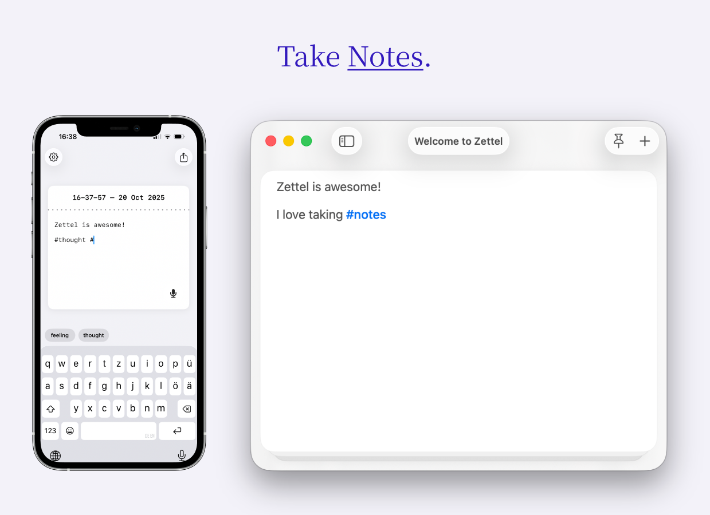
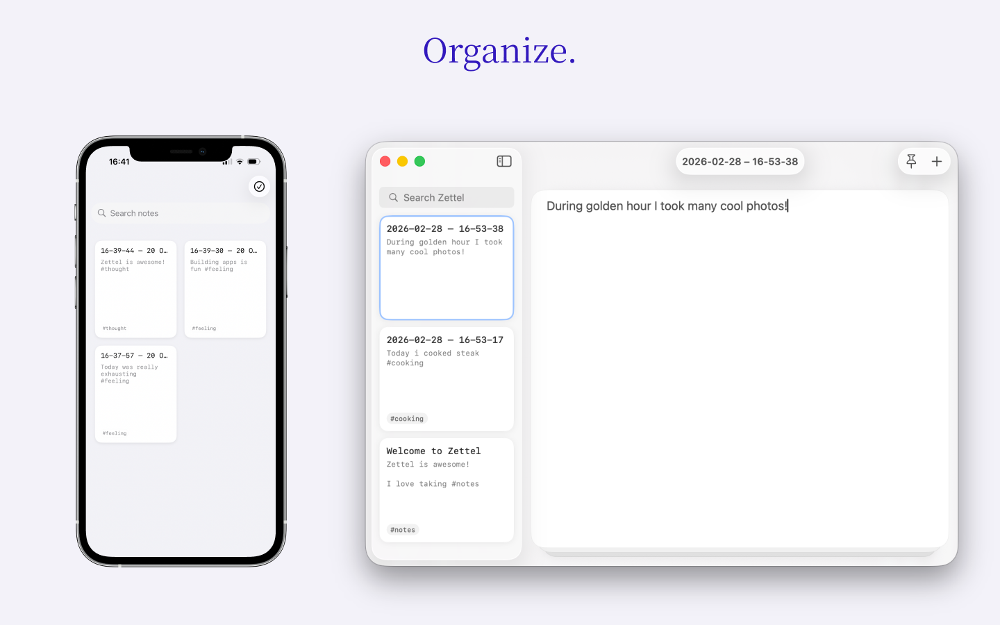

# Zettel

<p align="center">
  
  
  
</p>

Zettel is a minimal, distraction-free note-taking app available for **iPhone and Mac**.

## App Store

You can download Zettel for free:

- **iOS / macOS**: [App Store](https://apps.apple.com/de/app/zettel-quick-notes/id6748525244)

## Features

- **Single-note focus**: Edit one note at a time with full-screen interface
- **Tag system**: Organize notes with hashtags (#tag)
- **Markdown support**: Plain text with markdown formatting
- **Themes**: Light, dark, and system theme options
- **Tear gesture** _(iOS)_: Archive notes by swiping right anywhere on the note (mimics tearing paper)
- **File integration** _(iOS)_: Works with iOS Files app

## Requirements

### iOS

- iOS 17.6+
- iPhone only (portrait orientation)

### macOS

- macOS 15+

### Development

- Xcode 16.4+
- Apple Developer Account (for device deployment)

## Setup

1. **Clone the repository**

   ```bash
   git clone git@github.com:AlexW00/Zettel.git
   cd Zettel
   ```

2. **Configure your environment**
   ```bash
   cp .env.example .env
   ```
3. **Edit `.env` with your Apple Developer details:**
   - `DEVELOPMENT_TEAM`: Your Apple Developer Team ID (found in Apple Developer portal)
   - `BUNDLE_IDENTIFIER`: Your unique bundle identifier (e.g., `com.yourcompany.Zettel`)

## Building

```bash
./build.sh ios
# or
./build.sh macos
```

Or run the configuration and build separately:

```bash
./configure.sh  # Configure project with your environment
# Then build in Xcode or use xcodebuild directly
```

## Development Scripts

- `./configure.sh` - Configure Xcode project with environment variables
- `./build.sh <ios|macos>` - Configure and build for the specified platform
- `./clean.sh` - Reset project configuration to clean state

## Contributing

See [CONTRIBUTING.md](CONTRIBUTING.md) for development setup and contribution guidelines.

## Usage

### iOS

- **Create**: Start typing to create a new note
- **Archive**: Swipe from left/right edge and drag across screen to archive
- **View notes**: Swipe left to see archived notes
- **Tags**: Use #hashtags in your notes for organization
- **Settings**: Tap gear icon to change theme and storage location

### macOS

- **Create**: Start typing to create a new note
- **Archive**: Use the toolbar button or keyboard shortcut to archive a note
- **View notes**: Browse archived notes from the sidebar
- **Tags**: Use #hashtags in your notes for organization
- **Settings**: Open Preferences to change theme and storage location

## Storage

Notes are stored as Markdown files in your selected directory (default: Documents/). You can change the storage location in Settings and access files through Finder (macOS) or the Files app (iOS).
