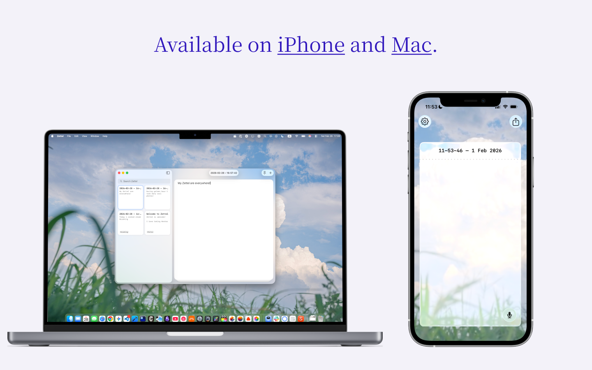

# Zettel

<p align="center">
  
  
</p>

Zettel is a minimal, distraction-free *local* note-taking app available for **iPhone and Mac**.

## App Store

You can download Zettel for free:

- **iOS / macOS**: [App Store](https://apps.apple.com/de/app/zettel-quick-notes/id6748525244)

## Features

- **Single-note focus**: Edit one note at a time with full-screen interface
- **Tag system**: Organize notes with hashtags (#tag)
- **Themes**: Light, dark, and system theme options
- **File integration:** All notes are just simple MarkDown files

## Requirements

### iOS

- iOS +26

### macOS

- macOS 26+

## Dev Setup

1. **Clone the repository**

   ```bash
   git clone git@github.com:AlexW00/Zettel.git
   cd Zettel
   ```

2. **Configure your environment**
   ```bash
   cp .env.example .env
   ```
3. **Edit `.env` with your Apple Developer details:**
   - `DEVELOPMENT_TEAM`: Your Apple Developer Team ID (found in Apple Developer portal)
   - `BUNDLE_IDENTIFIER`: Your unique bundle identifier (e.g., `com.yourcompany.Zettel`)

## Building

```bash
./build.sh ios
# or
./build.sh macos
```

Or run the configuration and build separately:

```bash
./configure.sh  # Configure project with your environment
# Then build in Xcode or use xcodebuild directly
```

## Development Scripts

- `./configure.sh` - Configure Xcode project with environment variables
- `./build.sh <ios|macos>` - Configure and build for the specified platform
- `./clean.sh` - Reset project configuration to clean state

## Testing

Run package tests without app configuration:

```bash
swift test --package-path Packages/ZettelKit
```

Run app-target tests after `./configure.sh`:

```bash
xcodebuild test -project Zettel.xcodeproj -scheme ZettelMac -destination 'platform=macOS' CODE_SIGNING_ALLOWED=NO
xcodebuild test -project Zettel.xcodeproj -scheme Zettel -destination 'platform=iOS Simulator,name=iPhone 16' CODE_SIGNING_ALLOWED=NO
```

## Contributing

See [CONTRIBUTING.md](CONTRIBUTING.md) for development setup and contribution guidelines.
